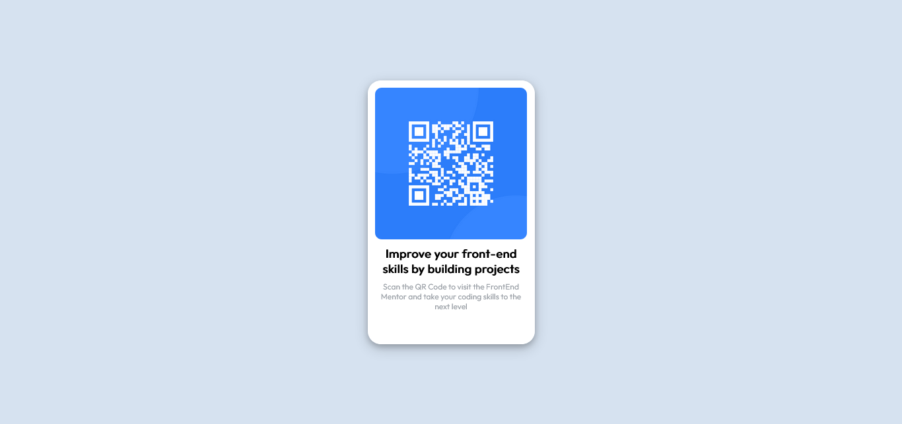

# Frontend Mentor - QR code component solution

This is a solution to the [QR code component challenge on Frontend Mentor](https://www.frontendmentor.io/challenges/qr-code-component-iux_sIO_H). Frontend Mentor challenges help you improve your coding skills by building realistic projects. 

💪 Challenge - [QR code component challenge on Frontend Mentor](https://www.frontendmentor.io/challenges/qr-code-component-iux_sIO_H)

✅ My Solution

- Solution URL: ➡ [Code](https://github.com/ashif8984/frontendmentor)
- Live Site URL: ➡  [Live URL](https://ashif8984.github.io/frontendmentor/)


## Overview

### Screenshot




## My process

### Built with

- Semantic HTML5 markup
- CSS custom properties
- Flexbox


### What I learned

I learned how to create Card Components using CSS. Also I learned how to use and debug CSS styles using Firefox inspect tool.  

```html
    <div class="container">
        <div class="card">
          ....
          ....
          ....
        </div>
      </div>
```
```css
.container{
    display: flex;
    justify-content: center;
    align-items: center; 
    height: 64.3rem;
}

.card{
    background-color: white;
    width: 25.3rem;
    height: 40rem;
    border-radius: 2rem;
    box-shadow: 0 4px 8px 0 rgba(0, 0, 0, 0.2), 0 6px 20px 0 rgba(0, 0, 0, 0.19);
}
```


### Continued development

Need to practise the Responsive design more so the webpage can be viewed accurately on all devices. 

### Useful resources

- Firefox browser inspect tool
- CSS Course from [@CodeWithHarry](https://www.youtube.com/watch?v=Edsxf_NBFrw&t=32s)

## Author

- Website - Ashif Eqbal
- Frontend Mentor - [@ashif8984](https://www.frontendmentor.io/profile/ashif8984)
- Twitter - [@AshifEqbal12](https://twitter.com/AshifEqbal12)

## Acknowledgments

Lucas (👉 [@correlucas](https://www.frontendmentor.io/profile/correlucas)) provided me feedback for my 1st challenge in FrontEnd Mentor. His suggestion helped to update my CSS styles. Thanks a ton - correlucas


